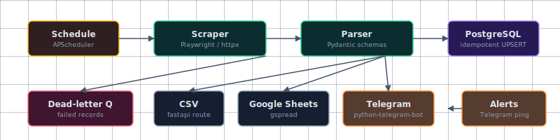

# Business Process Automation — Web Scraping + Data Pipeline (MVP)

> Manual copy-paste from 2-3 websites into spreadsheets is unreliable, slow, and unscalable.

**Built by: KMan | AI-Augmented Engineering Factory**

---

## Business Problem Solved

Manual copy-paste from 2-3 websites into spreadsheets is unreliable, slow, and unscalable. We replace it with an automated pipeline that:

1. **Scrapes** business data from target sites using Playwright (modern Chromium-based, headless)
2. **Cleans** the raw HTML into structured records (Pydantic-validated)
3. **Stores** records in PostgreSQL for history and deduplication
4. **Delivers** results as CSV exports + Google Sheets (via API) + Telegram summary
5. **Runs automatically** on cron schedule with retry/DLQ safety nets

Goal: a clean MVP that the operator can extend later — no over-engineering, no Kubernetes, no microservices.

---

## Scope

**Key functional requirements:**

| ID | Requirement | Priority |
|----|-------------|----------|
| FR-1 | Scrape 2-3 configurable target sites via Playwright | Must |
| FR-2 | Parse raw HTML into normalized Pydantic records | Must |
| FR-3 | Store records in PostgreSQL with upsert dedup | Must |
| FR-4 | Export to CSV (one-click download) | Must |
| FR-5 | Export to Google Sheets (auto-update) | Should |
| FR-6 | Cron-scheduled pipeline (default: daily 09:00 UTC) | Must |
| FR-7 | Retry on transient failures (3x exponential backoff) | Must |
| FR-8 | Dead-letter queue for permanent failures + alert | Must |
| FR-9 | Optional Telegram bot: ping on completion/failure | Should |
| FR-10 | Configuration via YAML (no code change for new sites) | Must |
| FR-11 | Health-check endpoint `/health` | Must |
| FR-12 | Operator CLI for manual runs (`python -m pipeline.cli`) | Should |

---

## 🏗 Technical Stack

| Category | Technologies |
| --- | --- |
| **Databases** | PostgreSQL |
| **Frameworks** | FastAPI, Playwright |
| **Infrastructure** | Docker |
| **Integrations** | Google Sheets, Telegram Bot |
| **Languages & Runtimes** | Python |
| **Scheduling** | APScheduler |

_See [SPEC.md](./SPEC.md) for the full tech stack and rationale._

---

## Architecture

### 🏗 Architecture — ETL / Scraping pipeline

<div align="center">



</div>

_Diagram is stack-adaptive — derived from the actual tech stack of this job._

_Repo: <https://github.com/9KMan/JOB-20260629151922-000117>_


---

## ✅ Acceptance Criteria

1. **API endpoint working end-to-end** — at minimum one data ingestion or query flow from request to database response
2. **Database models** — schema defined with ≥3 entities, migrations ready
3. **Authentication** — JWT or session auth on at least one protected endpoint
4. **ETL pipeline** — at least one transformation from raw input to structured output
5. **Tests** — pytest with ≥5 passing tests covering core functionality
6. **Docker** — project builds and runs via `docker compose up --build`
7. **README** — complete run instructions, architecture diagram, and feature list

---

## 🚀 Quick Start

```bash
# 1. Clone and enter
git clone https://github.com/9KMan/JOB-20260629151922-000117 && cd $(basename "https://github.com/9KMan/JOB-20260629151922-000117" .git)

# 2. Configure environment
cp .env.example .env
# Edit .env — set required environment variables

# 3. Start everything
docker compose up --build

# 4. Verify
curl http://localhost:8000/api/v1/health/
# → {"status":"ok","database":"connected"}
```

---

## 📦 What's in this repo

- `SPEC.md` — full job specification (source of truth)
- `ROADMAP.md` — phased delivery plan
- `CLAUDE.md` — operating notes for AI build workers
- `src/bpa/` — application source (FastAPI + Playwright/httpx scrapers + ETL pipeline)
- `tests/` — 48 pytest tests covering parsers, retry, dlq, settings, pipeline
- `config/targets.yaml` — sample target site configurations
- `diagrams/architecture.svg` — stack-adaptive system architecture diagram
- `Dockerfile`, `docker-compose.yml` — one-command boot
- `requirements.txt` — pinned Python dependencies
- `.env.example` — environment variable template
